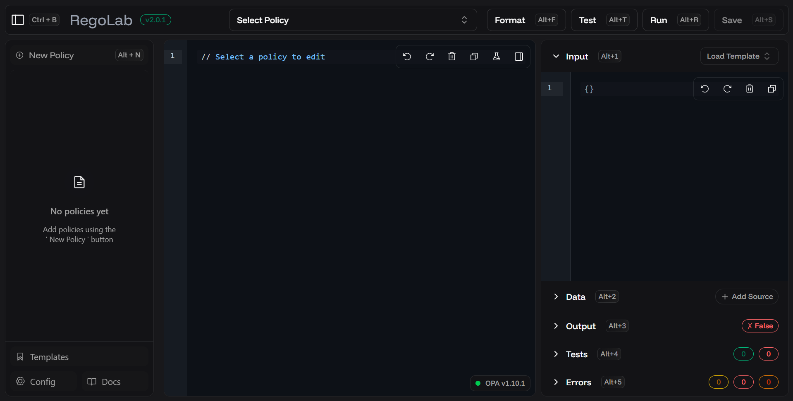

# RegoLab

RegoLab is a modern, interactive playground for developing, testing, and evaluating Open Policy Agent (OPA) Rego policies. It provides a seamless environment to write policies, define input/data JSON, and see evaluation results in real-time.



## Features

- **Unified Prototyping Environment**: Develop policies with a cohesive view of your Rego code, Input JSON, and Data context side-by-side.
- **Rich Template Library**: Jumpstart development with pre-built templates for common scenarios like Kubernetes Admission, Terraform, and API Authorization.
- **Real-time Feedback Loop**: Instant evaluation and testing against a live OPA instance, with integrated linting via Regal to catch issues early.
- **Data & Input Simulation**: Rapidly mock external data sources and input payloads using a curated collection of templates to simulate real-world conditions.
- **Policy Management**: Organize, save, and export your policy experiments with ease.

## Quick Start

The easiest way to run RegoLab is using Docker.

```bash
docker-compose up -d
```

Open your browser and navigate to [http://localhost:3000](http://localhost:3000).

## Development

To run the project locally for development:

### Prerequisites

- [Node.js](https://nodejs.org/) (v18+)
- [Open Policy Agent (OPA)](https://www.openpolicyagent.org/docs/latest/#running-opa) installed and available in your PATH.
- [Regal](https://docs.styra.com/regal) (optional) for linting support.

### Backend

The backend is a Fastify server that manages policy files and executes OPA commands.

```bash
cd backend
npm install
npm run dev
```
The backend will start on port 4000.

### Frontend

The frontend is a Next.js application.

```bash
cd frontend
npm install
npm run dev
```
The frontend will start on port 3000.


## Architecture

- **Frontend**: Next.js (React) with Tailwind CSS and Shadcn UI.
- **Backend**: Fastify (Node.js) API that manages policy files.
- **OPA**: Official Open Policy Agent binary for policy evaluation.
- **Regal**: Official Open Policy Agent Language Server and Linter.
- **CodeMirror 6**: An extensible code editor component used for the policy and JSON editors, providing syntax highlighting and editing features. 

